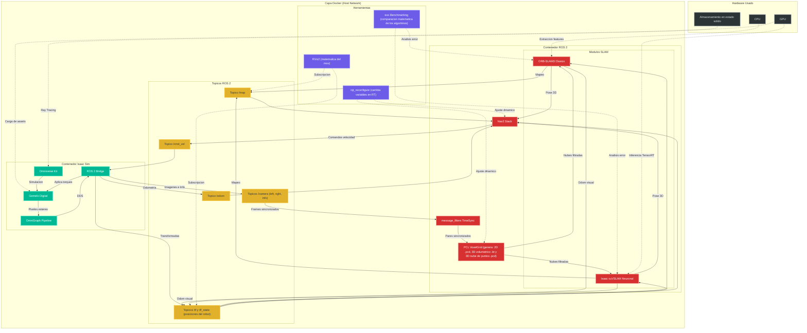

```mermaid
graph TD
    subgraph Hardware_Usado ["Hardware Usado"]
        CPU["CPU"]:::hardware
        GPU["GPU"]:::hardware
        NVMe["Almacenamiento en estado solido"]:::hardware
    end

    subgraph Capa_Docker_Network ["Capa Docker (Host Network)"]
        subgraph Contenedor_Isaac_Sim ["Contenedor Isaac Sim"]
            Omniverse["Omniverse Kit"]:::isaac
            Robot_USD["Gemelo Digital"]:::isaac
            OmniGraph["OmniGraph Pipeline"]:::isaac
            Bridge["ROS 2 Bridge"]:::isaac
        end

        subgraph Topicos_ROS_2 ["Topicos ROS 2"]
            T_Camera["Topicos /camera (left, right, info)"]:::topic
            T_Odom["Topico /odom"]:::topic
            T_Cmd["Topico /cmd_vel"]:::topic
            T_TF["Topicos /tf y /tf_static (posiciones del robot)"]:::topic
            T_Map["Topico /map"]:::topic
        end

        subgraph Contenedor_ROS_2 ["Contenedor ROS 2"]
            Sync["message_filters TimeSync"]:::ros2
            PCL["PCL VoxelGrid (genera: 2D .pcd, 3D volumetrico .bt y 3D nube de puntos .pcd)"]:::ros2
            
            subgraph Modulos_SLAM ["Modulos SLAM"]
                SLAM_C["ORB-SLAM3 Clasico"]:::ros2
                SLAM_N["Isaac cuVSLAM Neuronal"]:::ros2
            end
            
            Nav2["Nav2 Stack"]:::ros2
        end
        
        subgraph Herramientas ["Herramientas"]
            RQT["rqt_reconfigure (cambia variables en RT)"]:::tool
            Rviz["RViz2 (matematica del mov)"]:::tool
            Evo["evo Benchmarking (comparacion matematica de los algoritmos)"]:::tool
        end
    end

    %% Enlaces invisibles para forzar el orden vertical de las cajas
    Contenedor_Isaac_Sim ~~~ Topicos_ROS_2
    Topicos_ROS_2 ~~~ Contenedor_ROS_2
    Contenedor_ROS_2 ~~~ Herramientas

    %% Capa de hardware a Isaac Sim
    GPU -.->|Ray Tracing| Omniverse
    NVMe -.->|Carga de assets| Robot_USD
    Omniverse -->|Simulacion| Robot_USD
    Robot_USD -->|Pixeles estereo| OmniGraph
    OmniGraph -->|DDS| Bridge

    %% Envio de datos a ROS 2
    Bridge -->|Imagenes e Info| T_Camera
    Bridge -->|Odometria| T_Odom
    Bridge -->|Transformadas| T_TF

    T_Camera -->|Frames sincronizados| Sync
    Sync -->|Pares sincronizados| PCL
    PCL -->|Nubes filtradas| SLAM_C
    PCL -->|Nubes filtradas| SLAM_N

    %% Arbol TF y Odometria
    T_Odom --> Nav2
    T_TF --> SLAM_C
    T_TF --> SLAM_N
    T_TF --> Nav2

    %% Salida del SLAM
    SLAM_C -->|Mapeo| T_Map
    SLAM_N -->|Mapeo| T_Map
    SLAM_C -->|Odom visual| T_TF
    SLAM_N -->|Odom visual| T_TF
    SLAM_C -->|Pose 3D| Nav2
    SLAM_N -->|Pose 3D| Nav2

    %% Lazo de control Nav2
    T_Map --> Nav2
    Nav2 -->|Comandos velocidad| T_Cmd
    T_Cmd --> Bridge
    Bridge -->|Aplica torques| Robot_USD

    %% Herramientas de monitorizacion
    RQT -.->|Ajuste dinamico| PCL
    RQT -.->|Ajuste dinamico| Nav2
    Rviz -.->|Subscripcion| T_Map
    Rviz -.->|Subscripcion| T_TF
    Evo -.->|Analisis error| SLAM_C
    Evo -.->|Analisis error| SLAM_N

    %% Dependencias de IA
    GPU -.->|Inferencia TensorRT| SLAM_N
    CPU -.->|Extraccion features| SLAM_C

    classDef hardware fill:#2d3436,stroke:#b2bec3,stroke-width:2px,color:#dfe6e9;
    classDef docker fill:#0984e3,stroke:#74b9ff,stroke-width:2px,color:#ffffff;
    classDef isaac fill:#00b894,stroke:#55efc4,stroke-width:2px,color:#ffffff;
    classDef ros2 fill:#d63031,stroke:#fab1a0,stroke-width:2px,color:#ffffff;
    classDef topic fill:#e1b12c,stroke:#fbc531,stroke-width:2px,color:#2f3640;
    classDef tool fill:#6c5ce7,stroke:#a29bfe,stroke-width:2px,color:#ffffff;
```